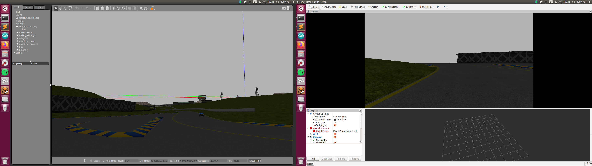
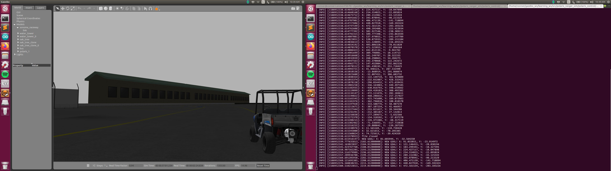

# polaris_ranger_sim

This package is a gazebo control plugin for a Polaris Ranger Ev. The package uses a PID controller for steer and drive. Ackerman steering is incorporated into the steer controller. 

This package also offers keyboard teleoperation and a waypoint follower. 


*Polaris at Sonoma Raceway with RVIZ camera feed*

## roslaunch 

The outdoor_world launch file spawns the Polaris (w/ controllers) in the outdoor sandbox world. Topics and PID arguments can be adjusted inside this file. 

```bash
roslaunch polaris_control outdoor_world.launch
```

Keyboard teleoperation is started with 

```bash
roslaunch polaris_control keyboard_teleop.launch
```

The waypoint follower is started with

```bash
roslaunch polaris_control waypoint_follower.launch
```

## Waypoints 

Waypoints can be set during keyboard teleop by pressing the spacebar. These waypoints will be exported to text file specified as an argument in the launch file. 

The waypoint follower interprets these text files.  


*Polaris following waypoints*